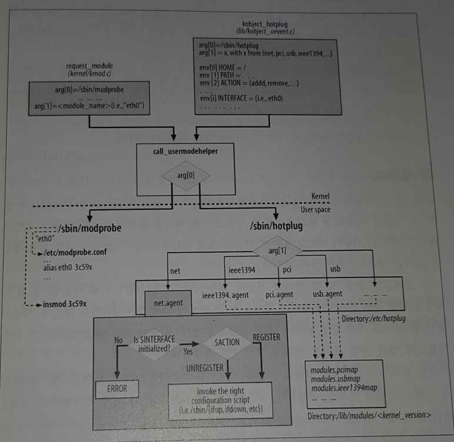

## User-Space Helpers
커널이 이벤트를 처리하기 위해 user-space 프로그램을 호출하는 경우가 있다. 이 때 2개의 헬퍼가 사용됨.
- /sbin/modprobe
  - 커널이 모듈을 로드해야 할 때
  -  module-init-tools 패키지에 포함
- /sbin/hotplug
  - 커널이 새로운 장치가 꽂히거나 뽑히는 것을 감지했을 때
  - 장치 식별자에 따라 정확한 디바이스 드라이버르르 로드하는 것이 주 역할
  - 장치는 꽂혀진 버스(eg. PCI)에 의해 식별되고, 버스에서 정한 규격에 따라 관련 ID를 부여 받음
  - hotpug 패키지에 포함

### kmod
- 커널 컴포넌트가 모듈을 로드할 수 있게 해주는 커널 모듈 로더
- 여기서는 request_module로 설명
- 이 함수는 arg[1]을 모듈 이름으로 초기화
- /sbin/modprobe는 /etc/modprobe.conf 파일을 사용해서 여러 작업을 수행. 예를 들어 커널에서 요청한 모듈의 이름이 실제 다른 것의 alias가 아닌지 확인하는 것.
- 커널이 /sbin/modprobe를 사용해서 모듈을 로드하는 두가지 예
  - 관리자가 ifconfig를 사용해서 디바이스 드라이버가 로드되지 않은 네트워크 카드(eg. eth0)를 설정하는 경우에 커널은 /sbin/modprobe에게 이름이 'eth0'인 모듈을 로드하게 요청
  - 사용자가 IPROUTE2 패키지의 tc 명령어로 장치에 트래픽 컨트롤을 설정하려고 할 때 큐잉 정책이나 커널에는 없는 분류기를 참고하기도 한다. 이 때 커널은 /sbin/modprobe에게 필요한 모듈을 로드하라고 요청함.

### hot plug
처음에 플러그앤플레이를 제공하기 위해 리눅스 커널에 들어오게 됐다.
부팅 시 핫 플러그 기능이 없는 장치도 관리하기 위해 사용될 수 있다. 개념상 작동 중인 시스템에 장치가 새로 꽂히든 부팅 시에 이미 장착돼 있든 상관하지 않는다. ( 두 경우 모두 알람을 받는다)
리눅스 시스템은 네트워크 장치를 비롯한 주변 장치를 초기화하기 위해 스크립트 세트를 실행한다. 부팅 시에 이미 존재하는 장치에 대한 알림은 무시된다.
커널 모듈을 컴파일할 때 객체 파일은 기본적으로 /lib/modules/커널버전 아래에 생성된다. 저 디렉토리에 modules.pcimap과 modules.usbmap 파일이 생성되는 데, 각각 커널에서 지원하는 장치의 PCI ID와 USD ID를 포함한다. 그리고 그 파일 안에는 각 ID에 연관된 커널 모듈 참조가 있다. 사용자 공간 헬퍼는 핫 플러그 가능한 장치가 꽂혔다는 알림을 받았을 때 이들 파일을 사용해 정확한 장치를 찾아낸다.

#### /sbin/hotplug
핫 플러그를 위한 기본 user-space helper는 Hotplug 패키지에 포함된 /sbin/hotplug 스크립트이다. 이 패키지는 /etc/hotplug와 /etc/hotplug.d에 포함된 파일을 통해 설정할 수 있다. 

## Virtual Devices
리눅스는 여러 종류의 가상 장치를 정의하는 것을 허가

### example of Virtual Devices
- 본딩
  - 물리 장치를 그룹핑해서 하나처럼 사용 가능
- 802.1Q
  - 802.3/이더넷 헤더 IEEE 규격을 확장한 것. VLAN 헤더라 불리는 가상 LAN 생성 가능
- 브리징
  - 4장에서.
- 인터페이스 에일리어싱
  - 하나의 실제 이더넷 인터페이스를 여러 개의 가상 인터페이스(eth0:0, eth0:1 등)로 확장하고 IP를 설정하기 위함. 현재는 여러 개의 IP를 설정하기 위해 가상 인터페이스를 생성할 필요는 없다. 30장에서.
- True equalizer(TEQL)
  - 트래픽 컨트롤에서 사용될 수 있는 큐잉 정책. 트래픽 컨트롤을 위해서는 특별한 장치를 생성해야 함.
- 터널 인터페이스

### 커널 네트워크 스택과 통신
가상 장치와 실제 장치가 커널과 통신하는 방법이 약간 다름. 다음과 같은 차이가 있음
- 초기화
  - 대부분의 가상 장치는 실제 장치처럼 net_device_data 스트럭처를 지정받음. 대부분의 가상 장치의 net_device 함수 포인터는 실제 장치의 함수 포인터를 감싸는 래퍼 함수로 초기화됨. 모든 가상장치가 그런 것은 아님
- 설정
  - 특정 가상 장치에만 적용되는 상위 필드를 설정해야 하고, ifconfig 같은 표준 도구를 사용할 수 없는 경우에는 가상 장치를 설정하기 위한 별도의 사용자 공간 도구를 제공.
- 외부 인터페이스
  - 각 가상 장치는 /proc에 파일이나 파일들을 포함한 디렉터리를 노출. 노출 정도는 가상 장치의 종류와 디자인에 따라 달라짐.
- 전송
  - 가상 장치와 실제 장치 관계가 1:1이 아닐 경우 전송 시에 사용할 실제 장치를 선택하는 루틴이 필요함. 다중 관계일 경우 트래픽 컨트롤 설정에 영향을 미치므로.
- 수신
  - 가상 장치는 소프트웨어 객체이므로 IRQ 핸들러를 등록하거나 I/O 포트와 메모리를 할당 받는 것과 같이 실제 시스템 자원과 통신할 필요 없다. 이 장치에 대한 트래픽은 먼저 실제 장치에서 과정을 거친후 전달된다. 패킷 수신은 가상 장치 종류별로 다르게 일어난다. 예시는 책 참조.
- 외부 알림
  - 커널 내부에서 특정 이벤트에 대해 다른 컴포넌트가 생성한 알림은 가상 장치뿐만 아니라 실제 장치도 인지해야 함. 가상 장치의 로직은 실제 장치 위에서 개발 됐으므로 실제 장치는 그 로직을 알지 못해 이러한 알림을 전달할 수 없다. 따라서 알림은 가상 장치로 직접 보내져야 한다. ex) 가상 장치 하나가 다운 되면 트래픽 분산 알고리즘은 다운된 가상장치를 더 이상 사용하면 안 된다.

## Tuning via /proc Filesystem

/proc 안의 몇 개 파일은 내부 데이터 스트럭처와 설정 변수를 노출한다. 자원이 장치에 의해 할당됐는지 추적하는 데 유용. 
/proc/sys/kernel 에는 modprobe와 hotplug 파일이 있다.
/proc/net 에서 net_dev_init과 dev-proc_init, dev_mcast_init을 통해 생성한 파일을 찾을 수 있다.
- dev
  - 커널에서 등록한 각 네트워크 장치의 수신이나 전송과 관계된 송수된 바이트 패킷수와 같은 통계값을 보여줌.
- dev_mcast
  - 커널에서 등록한 각 네트워크 장치의 IP 멀티캐스트와 관련된 변수를 보여줌.
- wireless
  - dev와 비슷하게 네트워크 코드 블록에서 수행된 dev->get_wireless_stats 가상 함수의 결과 값을 각 무선 장치별로 출력한다. (무선 함수와 관련된 것만)
- softnet_stat
  - 네트워크 코드에 의해 사용된 소프트웨어 인터럽트의 통계를 보여줌. 12장 참고.

/proc/drivers, /proc/bus, /pro/irq 등 여러 디렉터리들이 있다. 점차 /sys 디렉터리로 변경되는 중.

## Functions and Variables Featured in This Chapter
5장에서 다룬 함수, 매크로, 변수, 데이터 스트럭처 요약

| 이름                            | 설명                                                                                                        
| ------------------------------ | ------------------------------------------------------- 
| 함수와 매크로
| request_irq, free_irq          | IRQ 라인에 콜백 핸들러를 등록, 해제함. 등록은 배재되거나 공유될 수 있음
| request_region, release_region | I/O 포트와 메모리를 할당하고 해제                
| call_usermodehelper            | 사용자 공간 헬퍼 애플리케이션을 호출                                                        
| module_param                   | 모듈을 위한 설정 매개변수를 정의 하는 데 사용                                          
| net_dev_init                   | 부팅 시 네트워크 코드를 초기화
| 전역 변수
| dev_boot_phase                 | 레거시 코드가 NIC 디바이스 드라이버를 등록하기 전에 net_dev_init의 수행을 강제하기 위한 boolean flag
| irq_desc                       | IRQ description 벡터의 포인터
| 데이터 스트럭쳐
| struct irq_action              | 각 IRQ 라인은 이 스트럭처의 인스턴스에 의해 정의됨. 콜백 함수 포함
| net_device                     | 네트워크 장치

